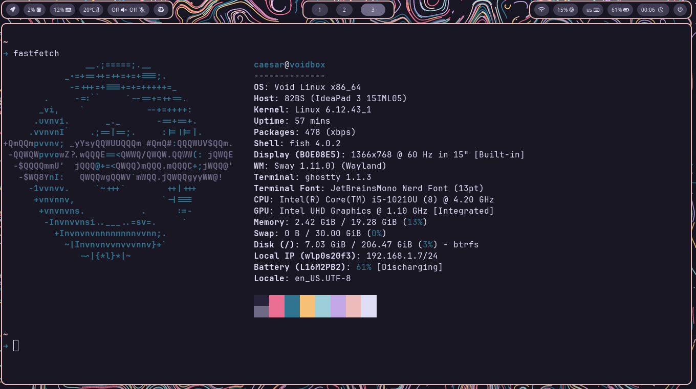
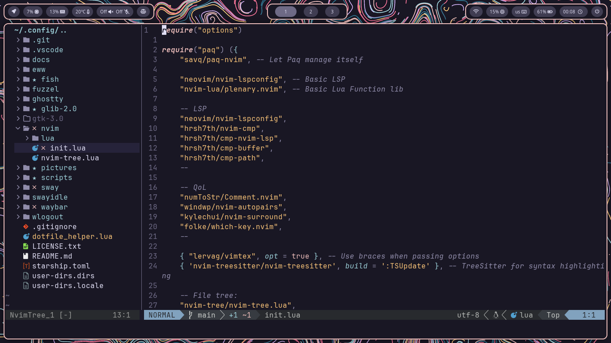
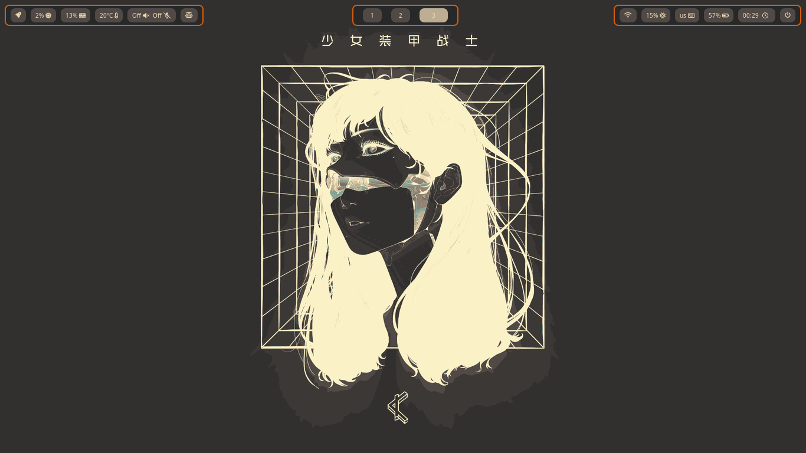
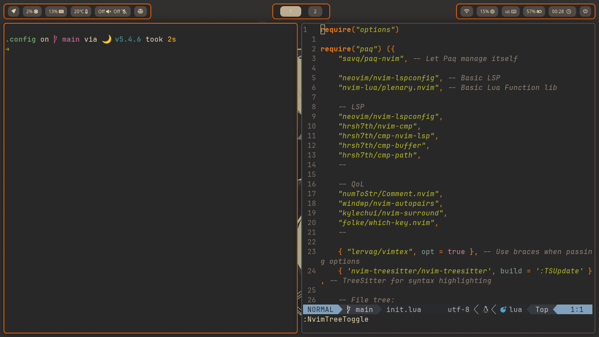

# Dotfiles (WIP)

## Current setup ([Preview](#preview))
- Distro: Arch Linux
- DM: `Ly`
- WM (Compositor): Sway (and its stack) + Waybar

### Motivation
My current goal with this setup is to configure a minimal, yet beautiful and customizable Graphical environment with as few dependencies as possible without resorting Gentoo.

## Dependencies (so far)
Please note that the package names used here are the ones found in the Void Linux package registry unless explictly marked as otherwise. Doing the same setup in other distros WILL require attention and care when installing the packages listed bellow.

### Compilers, Interpreters and Runtimes
- `lua`
- `gcc`
- `make`
- `cmake`
- `go`
- `rustc` - Via [`rustup`](https://www.rust-lang.org/learn/get-started)
- `nodejs`

### Core
- `git`
- `wget`
- `curl`

### Drivers
- `mesa`

### Services
- `bluez`
    - Bluetooth management
    - In Void Linux, this package already includes `bluez-utils` and, by extension, `bluetoothctl`
- `iwd`
- `pulseaudio`
    - Audio device abstraction
- `power-profiles-daemon`
    - Daemon for managing power consumption profiles
    - Options and availability may vary depending on Kernel config, version and Hardware specifications

### Fonts
- `dejavu-fonts-ttf`
- `otf-font-awesome`

### Graphical environment/session
- `ly`
    - TUI based Display manager
- `swayfx`
    - **Installed via AUR**
    - Backbone of the GE
    - Fork of the original
- `swww`
    - Wallpaper management daemon
- `swaync`
    - Notification center
    - Also provides a GTK+3 based GUI
- `swaylock-effects`
    - **Installed via AUR**
    - Lock screen for the current session
- `swayidle`
    - Idle state manager
- `waybar`
    - Status bar

### Config management (CLI, TUI or GUI based)
- `brightnessctl`
    - Daemon-less screen brightness control via CLI
- `pamixer`
    - Audio device control via CLI
- `pavucontrol`
    - Audio device control via GUI (GTK+3 based)

### Quality of Life (QoL)
- `xdg-user-dirs`
    - Used to create and manage user directories in a standardized way
- `wl-clipboard`
    - Basic clipboard for Compositors implemented following the Wayland protocol
- `chafa`
    - CLI utility to print and display images directly within the terminal using the kitty graphics protocol
    - Can also convert images into ASCII or colored character art

### Shell utilities
- `starship` - Installed via [starship.rs](https://starship.rs/)
    - Feature-rich, performant and customizable shell prompt
- `btop`
    - Process and performance TUI monitor
- `tree`
    - Utility to print directories and files hierarchicaly in a human-readable way
- `bat`
    - `cat`-like utility to print to stdout text with out-of-the-box syntax highlighting and pagination with vim-motions (for long files)
- `ripgrep`
    - For recurcevly searching directories for a regex pattern
- `fd-find`
    - Simpler and faster alternative to `find`

### Utilities
- `fastfetch`
    - Customizable system info fetcher
- `slurp`
    - Utility to visually select a region on a screen in Wayland compositors
- `grim`
    - Versatile CLI based screencapturing tool
- `wlogout`
    - Customizable GTK+3 based power menu
- `fuzzel`
    - GTK+3 based GUI launcher
    - Allows for fuzzy-finding Desktop entries and executing commands
- `iwmenu`
    - Manually built
    - Simple `iwd` wrapper to manage wireless connections in a GUI
    - Requires launcher that provides a `stdin` mode
- `neovim`
    - Code editor of choice
- `ghostty`
    - Feature-rich, performant and customizable shell emulator

## Dotfile helper

In this repository, I've included my own personal Dotfile helper script, written in Lua.
Run `lua dotfile_helper.lua --help` to learn how to use it.

## Roadmap

- [x] Bare-bones Sway config
- [x] Bare-bones Waybar config
- [x] Dotfile helper
- [x] Add Swaylock config
- [x] Add Swayidle config
- [x] Improve Waybar config
- [x] Bugfix issue with volume control keys
- [x] Solve "sticky" drag with mouse
- [x] Reorganize this repo
- [x] Rethink how theme switching should work
- [x] Abstract and automate theme switching with scripts
- [x] Add independent menus
    - [x] Power menu
    - [ ] Customize Power menu <
- [ ] Move away from Sway in favor of Hyper utils
    - [x] Replace Sway with Hyprland
    - [ ] Replace `swayidle` with `hypridle`
    - [ ] Replace `swaylock` with `hyprlock`
- [ ] Deprecate `dotfile_helper`
- [ ] Config `fastfetch`

## Preview

### Rose pine

### Gruvbox dark

