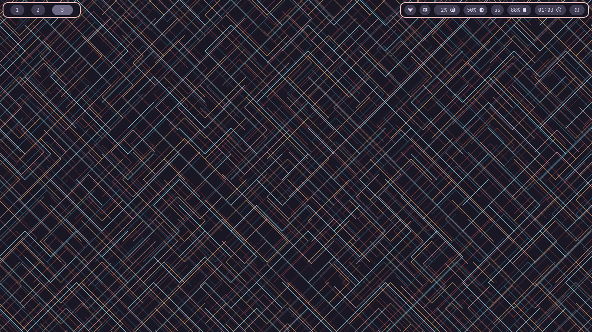

# Dotfiles (WIP)

## Current setup
- Distro: Arch Linux
- DM: Ly (TUI)
- WM (Compositor): Sway (and its stack) + Waybar

## Dependencies (so far)

### Compilers and Interpreters
- `lua`
- `go`
- `rustc` - Via [`rustup`](https://www.rust-lang.org/learn/get-started)

### Core
- `pulseaudio`
- `nerd-fonts` - Whole group
- `swayfx` - Via AUR or manual build
- `swaybg`
- `swaync`
- `swaylock-effects` - Via AUR or manual build
- `swayidle`
- `waybar`
- `eww` - Manually built
- `ghostty`
- `fuzzel`

### Utilities
- `xdg-user-dirs`
- `brightnessctl`
- `pamixer`
- `pavucontrol`
- `power-profiles-daemon`
- `starship`
- `btop`
- `tree`
- `wl-clipboard`
- `fastfetch`
- `slurp`
- `grim`
- `chafa`

## Dotfile helper

In this repository, I've included my own personal Dotfile helper script, written in Lua.
Run `lua dotfile_helper.lua --help` to learn how to use it.

## Roadmap

- [x] Bare-bones Sway config
- [x] Bare-bones Waybar config
- [x] Dotfile helper
- [x] Add Swaylock config
- [x] Add Swayidle config
- [ ] Improve Waybar config <- In progress
    - ADD PULSEAUDIO
- [ ] Config `fastfetch`
- [ ] Bugfix issue with volume control keys
- [ ] Solve "sticky" drag with mouse

## Preview

