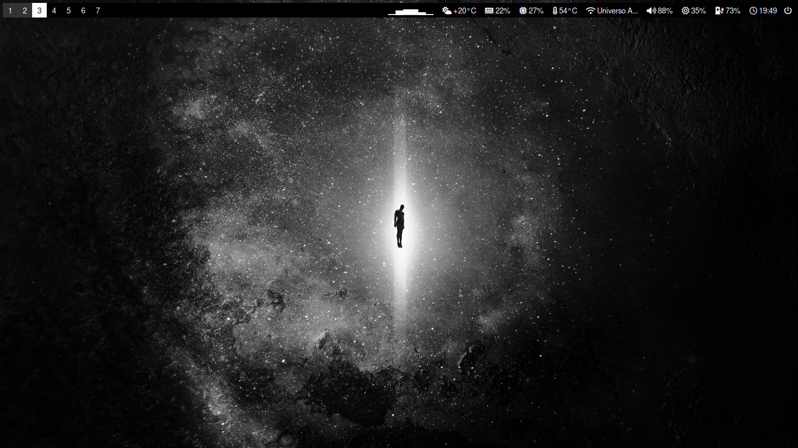
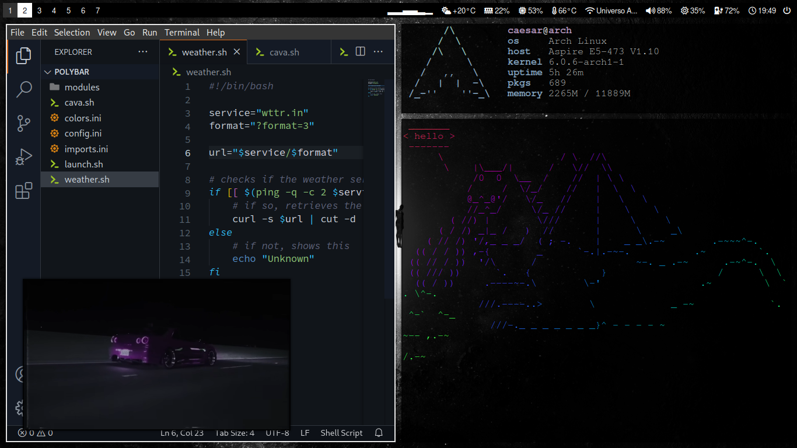
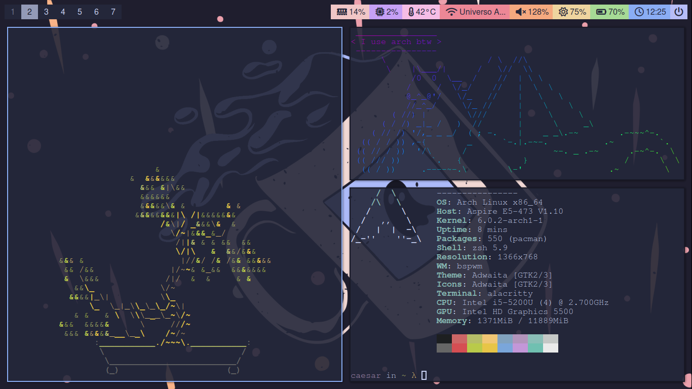
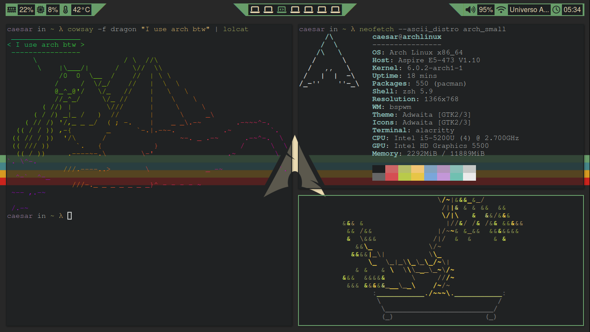

# Leo's dotfiles

This repo is meant to be where I store my config files (those usually stored in the `~/.config` directory, hence the name) for my current setup, so that they can be easily retrieved for recovery and to serve as reference for future configurations.

---
# Current Setup

## GNU/Linux
- Kernel: 6.0.6-arch1-1
- Distro: Arch Linux
- Display server: X
- WM: [bspwm 0.9.10](https://github.com/baskerville/bspwm)
- Compositor: [Picom](https://github.com/yshui/picom)
- Shell: Zsh 5.9 (w/ [Oh My Zsh!](https://github.com/ohmyzsh/ohmyzsh))
- Term: [Alacritty](https://github.com/alacritty/alacritty)

It is certainly worth noting that although my config files can be found in this repo, they are still subject to change, as I am **always** tinkering with them (specially with the bspwm).

## bspwm

To use any of the _bspwm_ setups:

1. Copy the contents of the `.config/sxhkd` and `.config/i3lock` directories to your`~/.config` directory
2. Copy the directories named after the desired setup from the following directories to your `~/.config` directory, renaming them accordingly:
    - `.config/alacritty`
    - `.config/bspwm`
    - `.config/polybar`
    - `.config/picom`

### void 🌀 - my current setup for bspwm

\

### blocky 🐱 - a [catppuccin](https://github.com/catppuccin/catppuccin) setup for bspwm

To enjoy this setup even more, add the `.config/firefox` to your `~/.config` directory and setup its `index.html` as your default start page on Firefox.

### gruv1 - a [gruvbox](https://github.com/morhetz/gruvbox) setup for bspwm

### tuxppuccin 🐧 - a [catppuccin](https://github.com/catppuccin/catppuccin) inspired setup for bspwm

To enjoy this setup even more, add the `.config/firefox` to your `~/.config` directory and setup its `index.html` as your default start page on Firefox.

\

## AwesomeWM

\

