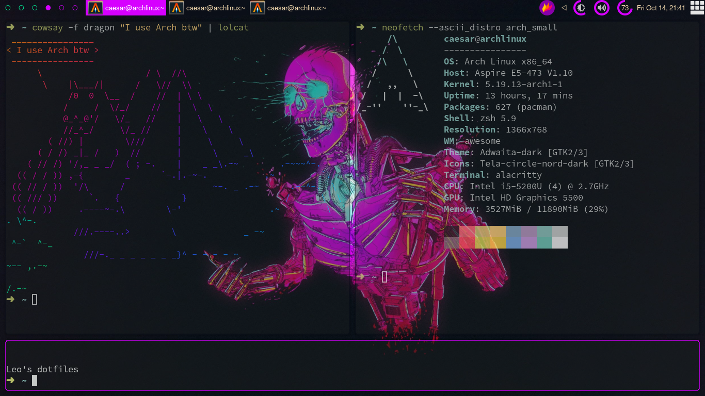

# Leo's dotfiles

This repo is meant to be where I store my config files (those usually stored in the `~/.config` directory, hence the name) for my current setup, so that they can be easily retrieved for recovery and to serve as reference for future configurations.

---
# Current Setup

### GNU/Linux
- Kernel: 5.19.13-arch1-1
- Distro: Arch Linux
- Display server: Xorg
- Display manager: LightDM Slick Greeter
- WM: Awesome 4.3
- Compositor: Picom ([jonaburg's fork](https://github.com/jonaburg/picom))
- Lock: i3lock (🚧config in progress)
- Shell: Zsh 5.9 (w/ [Oh My Zsh!](https://github.com/ohmyzsh/ohmyzsh))
- Terminal: [Alacritty](https://github.com/alacritty/alacritty)

It is certainly worth noting that although my config files can be found in this repo, they are still subject to change, as I am **always** thinkering with them (specially with the awesome).

### Preview

